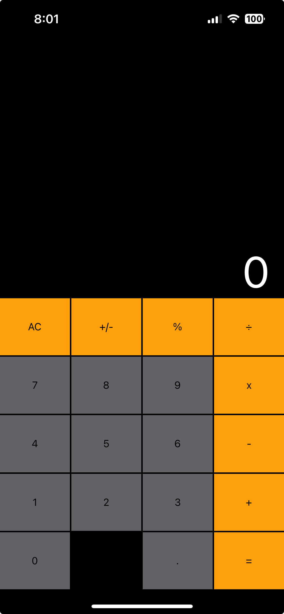
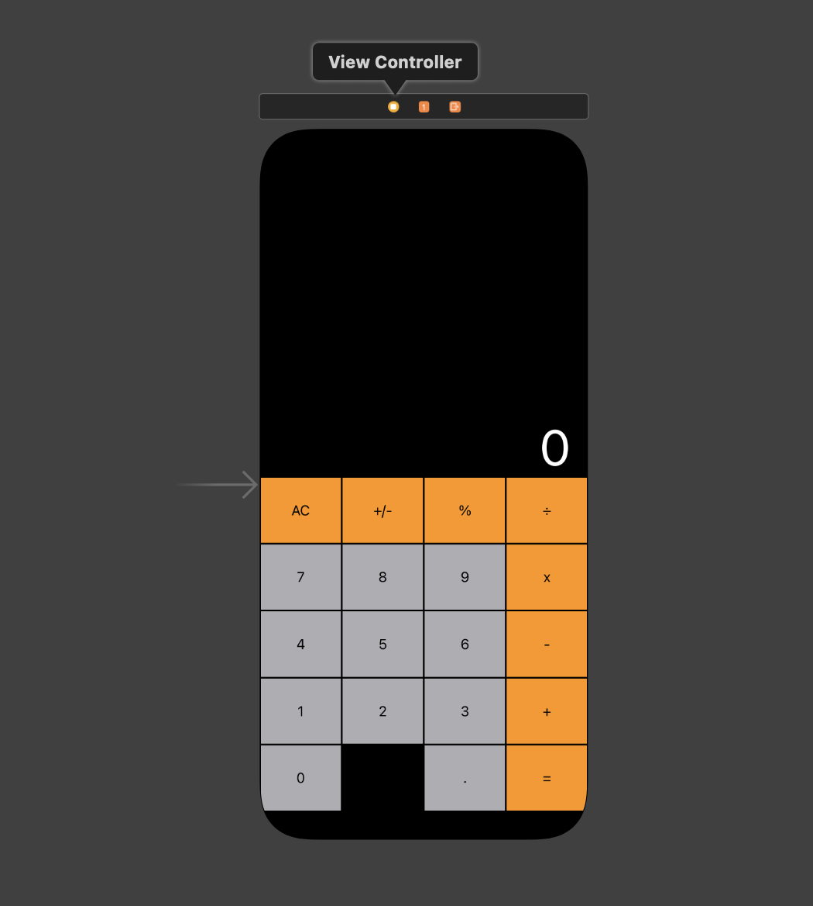

# Swift Calculator

This app is a mock version of the old iPhone calculator coded exclusively in Swift through Xcode 15. The app includes a storyboard interface that makes use of different ``UIStackView``s on top of each other to create a grid. 

## Screenshots

## Storyboard

